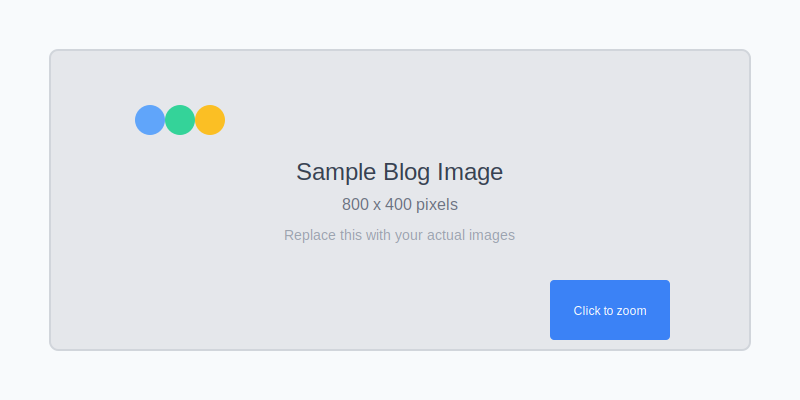

# Personal Blog with Markdown Support

A modern, responsive personal blog that supports Markdown posts for easy content creation and editing.

## 🚀 Quick Start

1. **Clone or fork this repository**
2. **Add your first post** to the `posts/` directory
3. **Add images** to the `images/posts/` directory
4. **Update `posts-list.json`** with your post metadata
5. **Test locally** with `python serve.py`
6. **Deploy to GitHub Pages** for free hosting

Ready to start blogging! 📝

## Features

- 📝 **Enhanced Markdown Support**: Comprehensive markdown parsing with advanced features
- 🎨 **Syntax Highlighting**: Beautiful code syntax highlighting with Prism.js for 100+ languages
- 🏷️ **Tag System**: Organize posts with tags and advanced filtering capabilities
- 📱 **Responsive Design**: Looks great on all devices with mobile-optimized layouts
- 🎯 **Modern UI**: Clean, professional design with improved typography and spacing
- 🚀 **GitHub Pages Ready**: Easy deployment with dual format support (MD + JSON)
- 📖 **Dynamic Post Loading**: Automatically loads posts from markdown or JSON files
- 🔍 **Advanced Search**: Full-text search across posts, titles, tags, and categories
- 📊 **Table Support**: Beautiful table rendering with hover effects and responsive design
- 🔗 **Smart Links**: External links open in new tabs automatically with security attributes
- 🖼️ **Professional Image Support**: 
  - Click-to-zoom functionality with full-screen modal
  - Automatic image captions from title text
  - Lazy loading for optimal performance
  - Responsive images that adapt to screen size
  - Organized directory structure for easy management
  - Hover effects and smooth animations
- ✨ **Advanced Text Formatting**: Bold, italic, strikethrough, and nested formatting support
- 📚 **Multiple Formats**: Supports both .md and .json post formats for maximum compatibility
- ⚡ **Performance Optimized**: Fast loading, efficient parsing, and minimal JavaScript footprint

## File Structure

```
personal-blog/
├── index.html              # Main homepage with search and filtering
├── post.html               # Template for individual posts with syntax highlighting
├── styles.css              # All CSS styles with responsive design
├── script.js               # Interactive features
├── markdown-parser.js      # Enhanced markdown to HTML converter
├── medium-converter.js     # Medium article import utility
├── convert-posts.js        # Post conversion utilities (Node.js)
├── convert-posts.py        # Post conversion utilities (Python)
├── serve.py                # Local development server
├── posts-list.json         # Configuration file listing all posts with metadata
├── CNAME                   # Custom domain configuration for GitHub Pages
├── .github/                # GitHub Actions workflows
│   └── workflows/
├── posts/                  # Directory containing markdown blog posts
│   ├── understanding-gpt-models.md
│   ├── understanding-vllm-architecture.md
│   └── [your-posts].md
├── posts-json/             # Directory containing JSON formatted posts (GitHub Pages fallback)
│   ├── understanding-gpt-models.json
│   ├── understanding-vllm-architecture.json
│   └── [your-posts].json
├── images/                 # Image assets directory
│   ├── posts/              # Images used in blog post content
│   ├── thumbnails/         # Smaller versions for previews
│   ├── icons/              # UI icons and small graphics
│   └── README.md           # Image usage documentation
└── README.md               # This documentation file
```

## How to Create a New Blog Post

### Step 1: Create a Markdown File

1. Create a new `.md` file in the `posts/` directory
2. Use a descriptive filename (e.g., `my-awesome-post.md`)

### Step 2: Add Front Matter

Every post must start with YAML front matter containing metadata:

```markdown
---
title: Your Post Title
date: 2025-08-27
category: Technology
excerpt: A brief description of your post that will appear on the homepage.
tags: ["Web Development", "JavaScript", "Tutorial", "Best Practices"]
---

# Your Post Title

Your post content goes here...
```

**Required Front Matter Fields:**
- `title`: The title of your post
- `date`: Publication date (YYYY-MM-DD format)
- `category`: Post category (e.g., Technology, Life, Tutorial)
- `excerpt`: Short description for the homepage

**Optional Front Matter Fields:**
- `tags`: Array of tags for categorization and filtering (e.g., ["JavaScript", "React", "Tutorial"])
- `author`: Author name (if different from default)
- `image`: Featured image URL

### Step 3: Write Your Content

Use enhanced Markdown syntax with the following supported features:

```markdown
## Headings (H1-H6)

# H1 Header
## H2 Header
### H3 Header
#### H4 Header
##### H5 Header
###### H6 Header

## Text Formatting

**Bold text**, *italic text*, and ***bold italic***
~~Strikethrough text~~
`Inline code`

## Lists (with nesting support)

* Bullet point 1
  * Nested bullet
* Bullet point 2

1. Numbered list item
   1. Nested numbered item
2. Another numbered item

## Code Blocks with Syntax Highlighting

Specify the language for beautiful syntax highlighting:

```javascript
function hello(name) {
    console.log(`Hello, ${name}!`);
    return `Welcome to the blog!`;
}
```

```python
def fibonacci(n):
    if n <= 1:
        return n
    return fibonacci(n-1) + fibonacci(n-2)
```

```css
.post-content {
    max-width: 800px;
    margin: 0 auto;
    padding: 2rem;
}
```

## Tables

| Feature | Status | Description |
|---------|--------|-------------|
| Markdown | ✅ | Full markdown support |
| Syntax Highlighting | ✅ | Prism.js integration |
| Tables | ✅ | Beautiful table styling |

## Links and Images

[External link](https://example.com) (opens in new tab)
[Internal link](/other-post.html)



## Blockquotes

> This is a blockquote
> 
> It can span multiple paragraphs
> and handles **formatting** properly

## Horizontal Rules

---

Three dashes create a horizontal line
```

### Step 4: Update Posts List

Add your new post to `posts-list.json` with the enhanced metadata format:

```json
[
  {
    "filename": "your-new-post.md",
    "title": "Your Post Title",
    "date": "2025-08-27",
    "category": "Technology",
    "excerpt": "Brief description of your post.",
    "tags": ["Web Development", "JavaScript", "Tutorial"]
  },
  {
    "filename": "understanding-gpt-models.md",
    "title": "Understanding GPT Models - A Deep Dive",
    "date": "2025-08-27",
    "category": "Technology",
    "excerpt": "A comprehensive technical guide to GPT model architecture.",
    "tags": ["Machine Learning", "Deep Learning", "NLP", "GPT", "Transformers", "AI"]
  }
]
```

**Important Notes:**
- Posts are displayed in the order they appear in this file
- The `tags` array is optional but recommended for better organization
- Each tag will appear in the filtering interface automatically
- Use consistent tag names across posts for better user experience

### Step 5: Test Locally

For local development, use the built-in Python server:

```bash
python serve.py
```

Then visit `http://localhost:8000` to see your blog with full functionality.

### Step 6: Generate JSON Format (Optional)

For GitHub Pages compatibility, you can convert markdown posts to JSON format:

```bash
# Using Node.js
node convert-posts.js

# Using Python
python convert-posts.py
```

This creates corresponding `.json` files in the `posts-json/` directory.

### Step 7: Publish to GitHub

```bash
git add .
git commit -m "Add new blog post: Your Post Title"
git push origin main
```

Your post will be live on GitHub Pages within minutes!

## Working with Images

### 📸 Adding Images to Posts

The blog supports rich image functionality with automatic optimization and zoom capabilities.

#### Image Directory Structure
```
images/
├── posts/          # Main images used in blog posts
├── thumbnails/     # Optional smaller versions for previews
├── icons/          # UI elements and small graphics
└── README.md       # Detailed image guidelines
```

#### Basic Image Usage
```markdown


```

#### Image Features
- ✅ **Responsive Design**: Images automatically resize for different screens
- ✅ **Lazy Loading**: Images load as users scroll for better performance  
- ✅ **Click to Zoom**: Click any image to view it in full-screen modal
- ✅ **Captions**: Add titles to images for automatic caption display
- ✅ **Hover Effects**: Subtle animations enhance user experience
- ✅ **Accessibility**: Proper alt text support for screen readers

#### Image Best Practices

1. **File Organization**
   ```
   images/posts/understanding-gpt-models-architecture.png
   images/posts/understanding-gpt-models-training.jpg  
   images/posts/vllm-performance-comparison.svg
   ```

2. **File Naming**
   - Use descriptive names: `gpt-architecture-diagram.png`
   - Include post topic: `understanding-transformers-attention.jpg`
   - Use hyphens, not spaces: `my-blog-post-image.png`

3. **Optimal Formats**
   - **JPEG**: Photos and complex images (smaller file size)
   - **PNG**: Screenshots, diagrams with transparency
   - **SVG**: Simple graphics, logos, icons (scalable)

4. **Image Sizes**
   - **Width**: 800px or less for optimal loading
   - **File Size**: Keep under 500KB when possible
   - **Height**: Let it scale naturally with width

5. **Adding Captions**
   ```markdown
   
   ```
   The title text becomes an elegant caption below the image.

#### Example Usage in Post
```markdown
---
title: Understanding Neural Networks
date: 2025-01-01
category: AI/ML
excerpt: A visual guide to neural network architecture
---

# Understanding Neural Networks

Neural networks are the foundation of modern AI. Let's visualize how they work:


The diagram above shows the three main components:

1. **Input Layer**: Receives data
2. **Hidden Layers**: Process information  
3. **Output Layer**: Produces results

For comparison, here's a deep learning model:


```

## Enhanced Markdown Features

### 🎨 Syntax Highlighting
Support for 100+ programming languages with beautiful color schemes:

```markdown
```javascript
const blog = new BlogGenerator();
blog.renderPosts();
```

```python
def create_post(title, content):
    return {"title": title, "content": content}
```

```bash
git add . && git commit -m "New post" && git push
```
```

### 📊 Tables
Create beautiful tables with automatic styling:

```markdown
| Feature | Support | Notes |
|---------|---------|-------|
| Headers | ✅ | H1-H6 supported |
| Tables | ✅ | With hover effects |
| Code | ✅ | Syntax highlighting |
```

### 🏷️ Advanced Text Formatting
```markdown
**Bold**, *italic*, ***bold italic***
~~Strikethrough text~~
`inline code`
```

### 📋 Enhanced Lists
```markdown
* Unordered lists
  * Nested items work perfectly
  * Multiple levels supported
* Mixed content supported

1. Ordered lists
   1. Nested numbered items
   2. Proper indentation
2. Sequential numbering
```

### 🔗 Smart Links
```markdown
[External link](https://example.com) - Opens in new tab
[Internal link](/post.html?file=my-post.md) - Same tab
 - With lazy loading
```

### 💬 Multi-line Blockquotes
```markdown
> This is a blockquote that can span
> multiple lines and paragraphs.
> 
> It supports **formatting** and maintains
> proper line breaks.
```

### ➖ Horizontal Rules
```markdown
---
***
___
```

### 📝 Complete Syntax Reference

| Element | Syntax | Result |
|---------|--------|---------|
| Headers | `# H1` to `###### H6` | Different heading levels |
| Bold | `**text**` or `__text__` | **Bold text** |
| Italic | `*text*` or `_text_` | *Italic text* |
| Strikethrough | `~~text~~` | ~~Strikethrough~~ |
| Code | `` `code` `` | `inline code` |
| Links | `[text](url)` | Clickable links |
| Images | `` | Embedded images |
| Lists | `* item` or `1. item` | Bulleted/numbered lists |
| Quotes | `> quote` | Indented quotes |
| Tables | `\| cell \|` | Formatted tables |
| Horizontal Rule | `---` | Divider line |

## Deployment to GitHub Pages

1. **Create GitHub Repository**:
   ```bash
   git init
   git add .
   git commit -m "Initial commit"
   git remote add origin https://github.com/USERNAME/personal-blog.git
   git push -u origin main
   ```

2. **Enable GitHub Pages**:
   - Go to repository Settings
   - Scroll to Pages section
   - Select "Deploy from a branch"
   - Choose "main" branch and "/ (root)" folder
   - Save

3. **Access Your Blog**:
   Your blog will be available at: `https://USERNAME.github.io/personal-blog/`

## Blog Features

### 🔍 Search and Filtering
Your blog includes powerful search and filtering capabilities:

- **Full-text search**: Search across post titles, content, tags, and categories
- **Tag filtering**: Click on any tag to filter posts by that tag
- **Multiple tag selection**: Combine multiple tags for refined filtering
- **Real-time results**: See results update as you type
- **Clear filters**: Easy one-click filter reset

### 🏷️ Tag System
- Tags automatically appear in the filtering interface
- Tag counts show how many posts use each tag
- Popular tags are sorted by frequency
- Consistent tag styling throughout the blog

### 📱 Responsive Design
- Mobile-optimized reading experience
- Touch-friendly interface elements
- Adaptive layouts for all screen sizes
- Optimized typography for readability

### ⚡ Performance Features
- Lazy loading images
- Efficient markdown parsing
- Minimal JavaScript footprint
- Fast page loads and smooth interactions

## Customization

### Styling
Edit `styles.css` to customize colors, fonts, and layout.

### Content
- Update the hero section in `index.html`
- Modify the About section
- Update contact links with your information

### Categories
Create new categories by simply using them in your post front matter. The system automatically handles new categories.

## Best Practices

### 📝 **Content Creation**
1. **Consistent Naming**: Use descriptive, URL-friendly filenames
2. **Post Order**: Organize posts chronologically in `posts-list.json`
3. **SEO Optimization**: Write descriptive titles, excerpts, and alt text
4. **Readability**: Break up long posts with headers, lists, and images
5. **Tag Strategy**: Use consistent, descriptive tags across posts for better discoverability

### 🖼️ **Image Management**
1. **File Organization**
   ```
   images/posts/post-topic-descriptive-name.png
   images/posts/understanding-ai-architecture-diagram.jpg
   images/posts/tutorial-step-1-screenshot.png
   ```

2. **File Naming Convention**
   - Use lowercase letters and hyphens
   - Include post topic for easy identification
   - Be descriptive: `neural-network-architecture.png` vs `image1.png`
   - Avoid spaces, special characters, and long names

3. **Image Optimization**
   - **File Size**: Keep images under 500KB for web performance
   - **Dimensions**: Max width of 800px for most blog images
   - **Formats**: 
     - JPEG for photographs and complex images
     - PNG for screenshots and images with transparency
     - SVG for simple graphics, diagrams, and icons
   - **Compression**: Use tools like TinyPNG or ImageOptim before uploading

4. **Accessibility and SEO**
   - Always include descriptive alt text
   - Use meaningful captions via title attribute
   - Consider screen readers when writing alt text
   - Make alt text descriptive but concise

5. **Responsive Design**
   - Images automatically scale, but choose appropriate base sizes
   - Test images on mobile devices
   - Consider vertical images for mobile viewing

### 🏷️ **Tagging Strategy**
1. **Consistency**: Use the same tag names across posts
2. **Hierarchy**: Consider both broad (`Technology`) and specific (`React.js`) tags
3. **Quantity**: Use 3-6 relevant tags per post
4. **Popular Tags**: Check existing popular tags before creating new ones

### 📱 **Mobile Optimization**
1. **Test Regularly**: View your blog on mobile devices
2. **Image Sizes**: Ensure images aren't too large for mobile screens
3. **Reading Experience**: Keep paragraphs reasonably short
4. **Touch Targets**: Ensure links and buttons are easily tappable

### 🔍 **Search and Discovery**
1. **Descriptive Titles**: Make titles searchable and clear
2. **Rich Excerpts**: Write compelling post summaries
3. **Internal Linking**: Reference other posts when relevant
4. **Categories**: Use categories consistently to organize content

## Troubleshooting

### Posts Not Showing
- Check that the post is listed in `posts-list.json` with correct filename
- Verify the markdown file exists in the `posts/` directory
- Ensure front matter is properly formatted with `---` delimiters
- Check for syntax errors in the JSON file using a JSON validator

### Markdown Rendering Issues
- Validate your Markdown syntax using a Markdown previewer
- Ensure proper spacing around headers, lists, and code blocks
- Use triple backticks (```) for code blocks, not single backticks
- Check that table syntax includes proper pipe separators (`|`)

### Syntax Highlighting Not Working
- Verify that code blocks specify the language (e.g., ```javascript)
- Check browser console for any JavaScript errors
- Ensure Prism.js is loading properly (check network tab)

### Search/Filter Issues
- Verify that posts have proper tags array in `posts-list.json`
- Check that all required fields are present in post metadata
- Clear browser cache and reload the page

### Local Development
Use the provided development server for full functionality:

```bash
# Recommended: Use the included server
python serve.py

# Alternative methods
python -m http.server 8000
# or
npx serve .
```

Then visit `http://localhost:8000`

### Image-Related Issues

#### Images Not Displaying
- Verify image file exists in the correct directory (`images/posts/`, etc.)
- Check file path in markdown matches actual file location
- Ensure image file names don't contain spaces (use hyphens instead)
- Confirm image formats are supported (JPEG, PNG, SVG, WebP)

#### Image Zoom Not Working
- Check browser console for JavaScript errors
- Ensure `initializeImageZoom()` function is being called
- Verify images have the `responsive-image` class
- Check that the image modal HTML elements exist in the DOM

#### Images Loading Slowly
- Optimize image file sizes (keep under 500KB when possible)
- Use appropriate formats: JPEG for photos, PNG for screenshots/diagrams
- Consider using SVG for simple graphics and icons
- Ensure lazy loading is working (check `loading="lazy"` attribute)

#### Caption Issues
- Captions come from the image title text: ``
- Check that title text is properly quoted in markdown
- Verify the `image-caption` CSS class is being applied

### GitHub Pages Issues
- Ensure CNAME file is properly configured for custom domains
- Check that both `posts/`, `posts-json/`, and `images/` directories are pushed
- Verify that GitHub Pages is enabled in repository settings  
- Wait a few minutes for changes to deploy
- Confirm image paths are relative (not absolute) for proper GitHub Pages deployment

## Contributing

Feel free to submit issues and enhancement requests!

## License

This project is open source and available under the [MIT License](LICENSE).